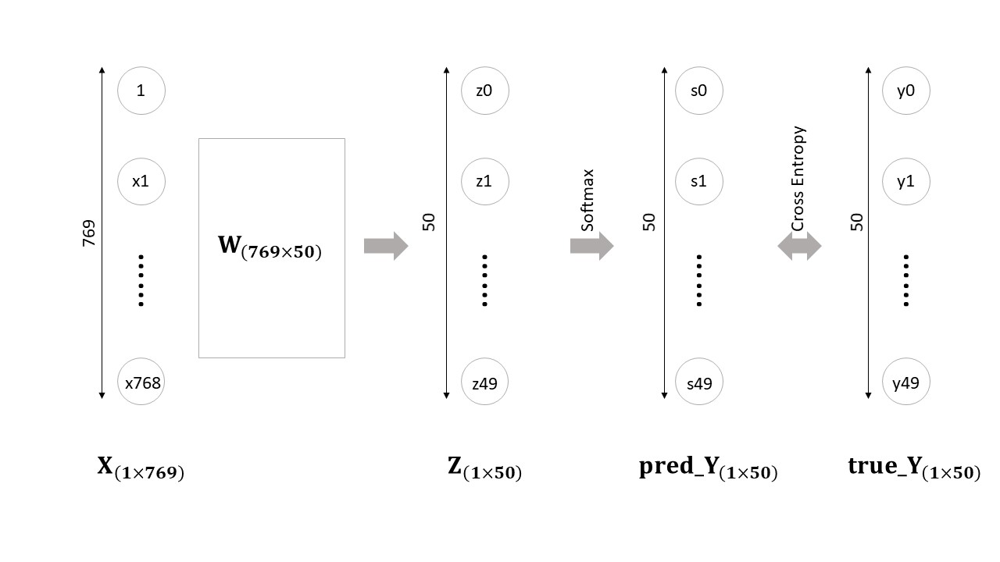
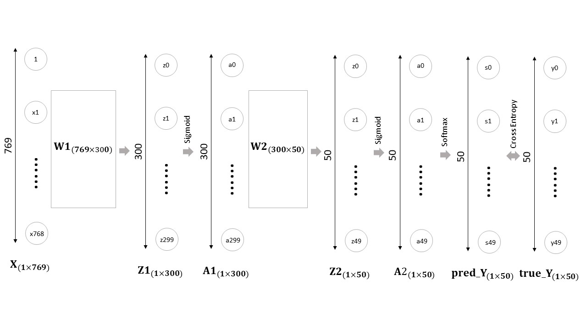

# Deep Learning - Backpropagation and Image Recognition
**Author:** Pei-Cheng, Li (h24074085@gs.ncku.edu.tw)

## Introduction
Backpropagation:  
  * Draw the computational graph
  * Find the gradients

Image Recognition (Programming):
  * One-layer Perceptron
  * Two-layer Perceptron
  * Performance Comparison

## Getting started
Data Source: [https://drive.google.com/open?id=1kwYYWL67O0Dcbx3dvZIfbGg9NiHdyisr](https://drive.google.com/open?id=1kwYYWL67O0Dcbx3dvZIfbGg9NiHdyisr)  
Data Introduction: There are 50 types of animals, and each type contains 1,300 images. 
The goal for our model is to recognize the animals in the future when we provide it an image.
### Requirements
You can install all the required packages using the following command: 

        pip install -r requirements.txt

### Running the code
#### One-layer Perceptron
* Image processing
  * Resize image to (256, 256, 3)
  * Feature extraction (Color Histogram)
* Model
  * Input: image feature vector (`X`; length = 256*3 + 1 = 769)
  * Weight: matrix contains all trainable parameters (`W`; shape = (769, 50))
  * Output: softmax (`pred_Y`; length = 50)

Using One-layer Perceptron Model: `-perceptron one`

        python main.py -perceptron one

#### Two-layer perceptron
* Image processing
  * Resize image to (256, 256, 3)
  * Feature extraction (Color Histogram)
* Model
  * Input: image feature vector (`X`; length = 256*3 + 1 = 769)
  * Hidden: 
    * 1st layer: weight matrix (`W1`; shape = (769, 300)) (X -> sigmoid(Z1))
    * 2nd layer: weight matrix (`W2`; shape = (300, 50)) (A1 -> sigmoid(Z2))
  * Output: softmax (`pred_Y`; length = 50)
  

Using Two-layer Perceptron Model: `-perceptron two`

        python main.py -perceptron two

#### Performance comparison 
* One-layer Perceptron vs. Two-layer Perceptron
* Validation Accuracy
  * Top 1: 10.47% vs. 13.36%
  * Top 5: 30.51% vs. 34.30%
* Test Accuracy
  * Top 1: 8.24% vs. 10.69%
  * Top 5: 28.73% vs. 33.41%
* Conclusion
  * The performance of the two-layer perceptron is better than the one-layer perceptron.
  * Possible reasons:
    1. There are more trainable parameters in two-layer perceptron (245,700) than in one-layer perceptron (38,450).
    2. The two-layer perceptron with the help of an activation function (Sigmoid).