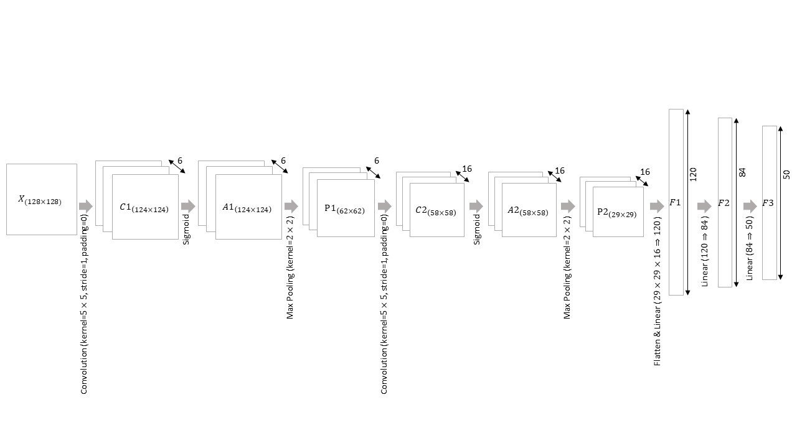

# Deep Learning - LeNet5
**Author:** Pei-Cheng, Li (h24074085@gs.ncku.edu.tw)

## Introduction
LeNet5:  
**[ Architecture ]** 

  * Version
    * Handcrafted
    * Tensorflow
    * Pytorch
    * TFLite

  * Performance
    * Accuracy
    * Inference time
    * Space complexity
    * Flops
    
## Getting started
Data Source: [https://drive.google.com/open?id=1kwYYWL67O0Dcbx3dvZIfbGg9NiHdyisr](https://drive.google.com/open?id=1kwYYWL67O0Dcbx3dvZIfbGg9NiHdyisr)  
Data Introduction: There are 50 types of animals, and each type contains 1,300 images. 
The goal for our model is to recognize the animals in the future when we provide it an image.  
Download the data folder: images, which contains images folder and three text (train, val, test).
### Requirements
You can install all the required packages using the following command: 

        pip install -r requirements.txt

### Running the code
#### Handcrafted
Using handcrafted LeNet5 Model:
1. go to `handcrafted` folder
2. execute `main.py`

        cd handcrafted
        python main.py

#### Tensorflow
Using Tensorflow LeNet5 Model:
1. go to `tensorflow` folder
2. execute `main.py`

        cd tensorflow
        python main.py

#### Pytorch
Using Pytorch LeNet5 Model:
1. go to `pytorch` folder
2. execute `main.py`

        cd pytorch
        python main.py

#### TFLite
Convert Tensorflow LeNet5 Model to TFLite LeNet5 Model:
1. go to `tflite` folder
2. execute `main.py`

        cd tflite
        python main.py
3. use [the official benchmark tool](https://www.tensorflow.org/lite/performance/measurement) to evaluate the performance of your model.